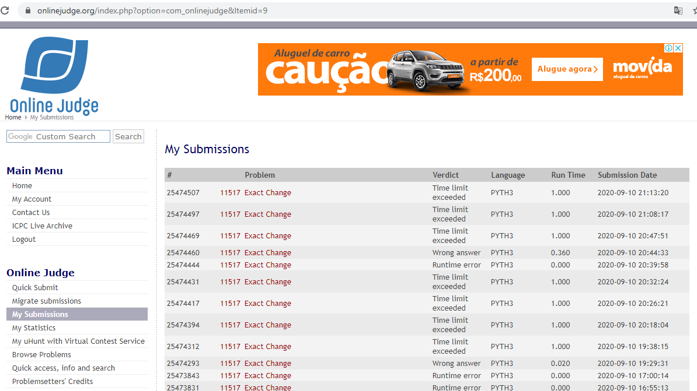

# Trabalho de Programação -- Programação Dinâmica -- Parte 1
**Autor:** Edimar Antonio da Cruz
**Data:** 08 de setembro de 2020
**Problema:** 11517 -- Exact Change
## Sobre a Solução
Este diretório contém o código fonte gerado para solucionar o problema 11517
do *Online Judge*. O problema recebeu veredito \Time limit exceeded",
como mostrado na figura abaixo:

O programa foi desenvolvido em Python.
